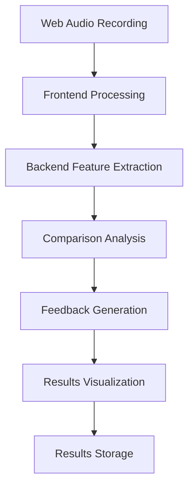

# Sound Recording & Analysis Process Pipeline

## Overview
This pipeline implements the simplified V1 of Sound Recording & Analysis Process using the selected tech stack. The pipeline processes a single phoneme recording and compares it with a target sound.

## Pipeline Steps

### 1. Audio Recording (Frontend - Web Audio API)
1. Initialize audio context and recorder
2. Create audio stream from microphone
3. Buffer the audio data in memory
4. Convert to WAV format
5. Store temporarily in IndexedDB

### 2. Initial Audio Processing (Frontend - Web Audio API)
1. Create AudioBuffer from recording
2. Apply noise reduction filter
3. Normalize audio volume
4. Generate initial waveform visualization (Chart.js)
5. Send to backend for analysis

### 3. Feature Extraction (Backend - librosa/scipy)
1. Load audio data into numpy array
2. Extract key features:
   - Frequency spectrum using FFT
   - Amplitude envelope
   - Fundamental frequency
   - Spectral centroid
   - Root mean square energy
3. Store features in temporary cache

### 4. Target Sound Comparison (Backend - scipy)
1. Load target sound features from database
2. Calculate similarity metrics:
   - Frequency correlation
   - Amplitude envelope matching
   - Energy distribution comparison
3. Generate similarity score (0-100%)
4. Store results in PostgreSQL

### 5. Feedback Generation (Backend - FastAPI)
1. Apply scoring thresholds
2. Generate feedback messages based on:
   - Overall similarity score
   - Specific feature differences
   - Known phoneme-specific criteria
3. Package results for frontend

### 6. Results Visualization (Frontend - Chart.js)
1. Receive analysis results via WebSocket
2. Generate comparative visualizations:
   - Frequency spectrum overlay
   - Amplitude envelope comparison
   - Similarity score gauge
3. Display feedback messages
4. Update UI components

### 7. Results Storage (Backend - PostgreSQL)
1. Store attempt metadata:
   - Timestamp
   - Similarity score
   - Key feature measurements
2. Update user progress metrics
3. Store reference to audio file (if needed)

## Data Flow 

## Error Handling Points
1. Audio permission denial
2. Recording quality issues
3. Network transmission errors
4. Processing pipeline failures
5. Database operations errors

## Performance Considerations
- Audio processing done in chunks
- WebSocket for real-time feedback
- Caching of frequent computations
- Efficient database queries
- Optimized visualization updates

## Future Extension Points
1. Add facial recognition pipeline
2. Integrate machine learning models
3. Add real-time analysis
4. Expand feature extraction
5. Add multi-language support